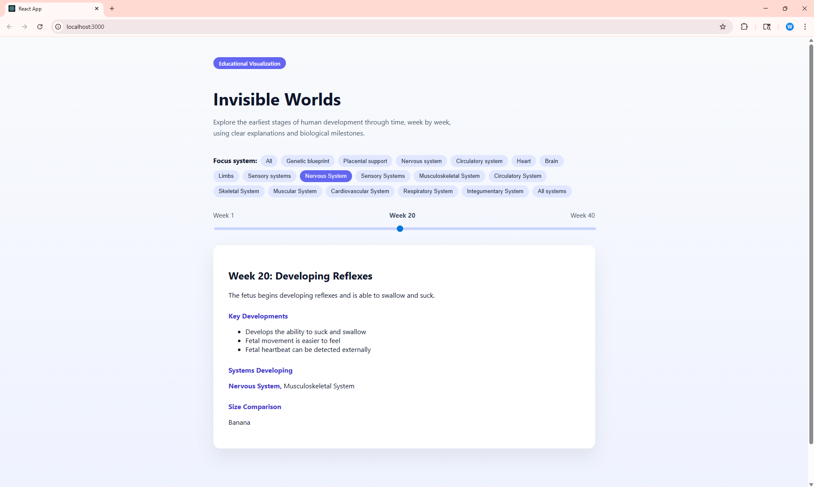

# Invisible Worlds: Human Development Timeline

**Invisible Worlds** is an educational web app that visualizes the **nine-month journey** of human development from conception to birth. The app provides an interactive timeline, detailing **biological systems**, **milestones**, and **critical stages** during pregnancy, giving users an engaging way to learn about fetal development.

### Key Features:
- **Interactive Timeline**: Navigate through the 40-week timeline of human development.
- **Trimester Focus**: See how development progresses during each trimester.
- **System-Specific Filtering**: Focus on specific biological systems (e.g., **Nervous**, **Cardiovascular**, **Musculoskeletal**).
- **Real-Time Slider**: Smooth, responsive slider to explore the stages of pregnancy week by week.

### Technologies Used:
- **Frontend**: React, JavaScript (ES6+), CSS (custom styling with smooth transitions)
- **Backend**: Python, FastAPI (for providing week-by-week human development data)
- **Development Tools**: Prettier, Git, GitHub, VS Code, PyCharm

### Getting Started:

1. **Clone the Repository**:
    ```bash
    git clone https://github.com/yourusername/invisible-worlds.git
    cd invisible-worlds
    ```

2. **Frontend Setup**:
    ```bash
    cd frontend
    npm install
    npm start
    ```

3. **Backend Setup**:
    ```bash
    cd backend
    uvicorn app.main:app --reload
    ```

4. Visit **http://localhost:3000** to view the app.

### Project Motivation:
- **Educational Purpose**: Designed to help users understand human development visually, with an emphasis on scientific accuracy and ease of exploration.
- **Growth Potential**: Future versions will include AI-powered explanations, user accounts, and full integration with **Base44** for dynamic data.

### Screenshots:



### Future Features:
- **Base44 Integration**: A system that allows for personalized timelines.
- **Mobile App**: Full mobile support for easy access.
- **User Accounts**: Save progress and mark key weeks of interest.
